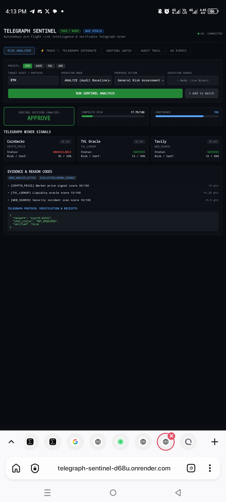
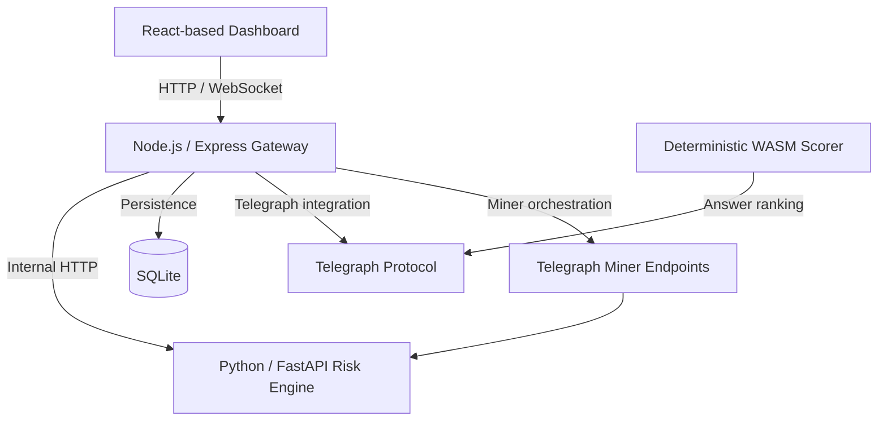

# Telegraph Sentinel

> **Verified machine intelligence before every critical crypto decision.**

Telegraph Sentinel is an autonomous pre-flight DeFi risk-intelligence application and Telegraph miner/oracle implementation. It combines live market data, risk analysis, miner intelligence, persistence, real-time updates, and a deterministic WASM semantic scorer in a single project.

**Network:** Base Sepolia (`eip155:84532`)

## Live deployment

- **Dashboard:** https://telegraph-sentinel-d68u.onrender.com
- **Miner endpoint:** `POST https://telegraph-sentinel-d68u.onrender.com/api/v1/miner/risk-assessment`
- **Miner specification:** [`docs/sentinel-miner.yaml`](docs/sentinel-miner.yaml)
- **WASM scorer artifact:** [`docs/sentinel_scorer.wasm`](docs/sentinel_scorer.wasm)
- **Integration documentation:** [`docs/telegraph-integration.md`](docs/telegraph-integration.md)
- **Deployment guide:** [`docs/deployment.md`](docs/deployment.md)



## What it provides

- **Live crypto intelligence** through the production miner endpoint.
- **Pre-flight risk analysis** combining market, TVL, and news signals.
- **Telegraph miner integration** through a machine-readable YAML specification.
- **WASM semantic scoring** for deterministic answer-quality ranking.
- **Persistent audit data** using SQLite.
- **Real-time updates** through WebSockets.
- **Browser dashboard** served by the Node.js gateway.

## Architecture



A larger version of the architecture is maintained in [`docs/architecture.md`](docs/architecture.md).

## Repository structure

```text
.
├── backend/
│   ├── node/                # Gateway, miner API, dashboard, WebSocket layer
│   └── python/              # FastAPI risk-analysis engine
├── docs/
│   ├── assets/              # Documentation images
│   ├── architecture.md      # System architecture
│   ├── demo.md              # Demonstration flow
│   ├── deployment.md        # Production deployment notes
│   ├── development.md       # Local development notes
│   ├── risk-model.md        # Risk-scoring model
│   ├── sentinel-miner.yaml  # Telegraph miner specification
│   ├── sentinel_scorer.wasm # WASM scorer artifact
│   └── telegraph-integration.md
├── wasm/                    # WASM source/build and validation tooling
├── Dockerfile
└── README.md
```

## Quick start

### Local gateway

```bash
cd backend/node
npm install
npm run build
npm start
```

The gateway is configured for local development around `http://localhost:4000`.

### WASM validation

From the repository root:

```bash
node wasm/validate_scorer.js
```

Use the repository's validation tooling to inspect the scorer before any protocol submission. The local benchmark is not a substitute for Telegraph's hidden on-chain evaluation set.

## Production API example

```bash
curl -s -X POST \
  https://telegraph-sentinel-d68u.onrender.com/api/v1/miner/risk-assessment \
  -H "Content-Type: application/json" \
  -d '{"asset":"BTC"}'
```

## Documentation

| Document | Purpose |
|---|---|
| [`docs/architecture.md`](docs/architecture.md) | System components and data flow |
| [`docs/demo.md`](docs/demo.md) | Demonstration walkthrough |
| [`docs/deployment.md`](docs/deployment.md) | Render and production deployment notes |
| [`docs/development.md`](docs/development.md) | Local development workflow |
| [`docs/risk-model.md`](docs/risk-model.md) | Deterministic risk model and thresholds |
| [`docs/telegraph-integration.md`](docs/telegraph-integration.md) | Telegraph integration notes |
| [`docs/sentinel-miner.yaml`](docs/sentinel-miner.yaml) | Miner registration specification |

## Project status

The repository contains the submitted Telegraph Sentinel implementation, its documentation, production deployment references, miner specification, and WASM artifact. Documentation is intentionally kept separate from the application/runtime code so presentation improvements do not alter the submitted runtime behavior.

## License

No license file is currently declared in this repository.
