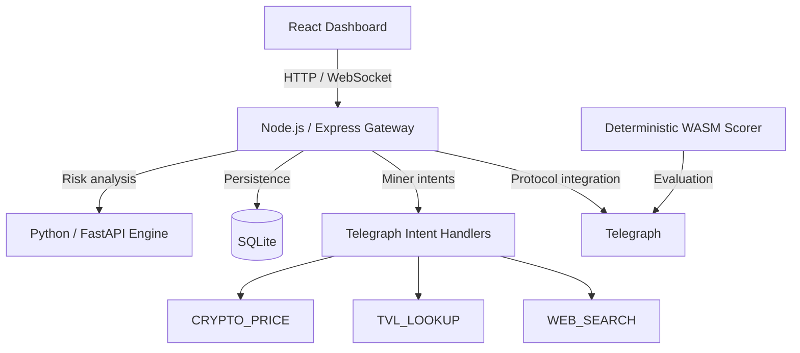

# Telegraph Sentinel

> **Production-ready risk intelligence for Telegraph miners and DeFi pre-flight analysis.**

Telegraph Sentinel is an autonomous risk-intelligence application and Telegraph miner implementation. It combines live crypto pricing, protocol TVL, web intelligence, deterministic WASM scoring, persistent audit data, and a browser dashboard behind a single project.

**Telegraph network:** Base Sepolia (`eip155:84532`)

## Production

- **Dashboard:** https://telegraph-sentinel-d68u.onrender.com
- **Miner endpoint:** `POST /api/v1/miner/risk-assessment`
- **TVL endpoint:** `POST /api/v1/miner/tvl`
- **Web-search endpoint:** `POST /api/v1/miner/web-search`
- **Health:** `GET /health`
- **Miner specification:** `GET /api/v1/miner/spec.yaml`

## Core capabilities

- **CRYPTO_PRICE** — live market prices with provider fallbacks and short-lived caching.
- **TVL_LOOKUP** — protocol TVL retrieval with historical context and aliases.
- **WEB_SEARCH** — grounded web intelligence with primary-provider and fallback retrieval.
- **Risk engine** — combines available signals into a deterministic risk decision and confidence score.
- **WASM scorer** — deterministic answer-quality evaluation for the Telegraph scoring workflow.
- **Audit persistence** — SQLite-backed analysis and watch-rule storage.
- **Realtime updates** — WebSocket events for completed analyses.
- **Dashboard** — browser UI for monitoring and interacting with the system.

## Architecture


```mermaid
graph TD
    UI[React Dashboard] -->|HTTP / WebSocket| G[Node.js / Express Gateway]
    G -->|Risk analysis| R[Python / FastAPI Engine]
    G -->|Persistence| DB[(SQLite)]
    G -->|Miner intents| I[Telegraph Intent Handlers]
    I --> C[CRYPTO_PRICE]
    I --> T[TVL_LOOKUP]
    I --> W[WEB_SEARCH]
    G -->|Protocol integration| P[Telegraph]
    S[Deterministic WASM Scorer] -->|Evaluation| P
```

See [`docs/architecture.md`](docs/architecture.md) for the component-level description.

## Repository layout

```text
.
├── backend/
│   ├── node/                  # Production Node.js gateway and miner API
│   └── python/                # FastAPI risk-analysis engine
├── frontend/                  # Standalone frontend package
├── src/                       # Root application/dashboard source
├── wasm/                      # WASM scorer source and validation tooling
├── docs/                      # Architecture, deployment, integration and scorer docs
├── fixtures/                  # Deterministic local test fixtures
├── .github/                   # CI, dependency automation and contribution templates
├── Dockerfile                 # Production Node gateway image
└── README.md
```

## Development

### Node gateway

```bash
cd backend/node
npm install
npm run build
npm start
```

The gateway normally listens on `http://localhost:4000`.

### Python risk engine

Create a virtual environment and install the pinned dependencies:

```bash
cd backend/python
python -m venv .venv
# Linux/macOS
source .venv/bin/activate
pip install -r requirements.txt
```

Run the service with:

```bash
uvicorn app.main:app --host 0.0.0.0 --port 8000
```

### Tests

Provider-focused Node tests:

```bash
cd backend/node
npm run test:tvl
npm run test:web-search
```

The gateway/integration suites expect a running gateway. See [`docs/development.md`](docs/development.md).

Validate the committed WASM artifact with:

```bash
node wasm/validate_scorer.js
```

Local validation is a regression check; it does not reproduce Telegraph's hidden evaluation set.

## Production deployment

The production Node service is deployed from `backend/node` on Render.

Typical configuration:

- **Root directory:** `backend/node`
- **Build:** `npm install && npm run build`
- **Start:** `npm start`
- **Port:** deployment-provided `PORT`, defaulting locally to `4000`
- **Environment:** `NODE_ENV=production`

Secrets and provider credentials belong in deployment environment variables and must never be committed to Git.

See [`docs/deployment.md`](docs/deployment.md) for deployment notes.

## Telegraph integration

The machine-readable miner specification is maintained at [`docs/sentinel-miner.yaml`](docs/sentinel-miner.yaml). The committed WASM artifact is [`docs/sentinel_scorer.wasm`](docs/sentinel_scorer.wasm), with the build and validation workflow documented in [`docs/WASM_SUBMISSION.md`](docs/WASM_SUBMISSION.md).

Runtime code, protocol artifacts, and operational documentation are intentionally kept separate so documentation and presentation work can be improved without silently changing the registered scoring artifact.

## Engineering standards

- Keep the three registered intents (`CRYPTO_PRICE`, `TVL_LOOKUP`, `WEB_SEARCH`) intact.
- Prefer evidence-backed provider changes over benchmark-specific tuning.
- Keep provider fallbacks deterministic and observable.
- Never commit credentials, private keys, local databases, build caches, or generated dependency directories.
- Run the relevant tests before deployment.
- Treat the committed WASM artifact as a versioned protocol artifact; change it only with explicit validation and documentation.

## Documentation

| Document | Purpose |
|---|---|
| [`docs/architecture.md`](docs/architecture.md) | System components and data flow |
| [`docs/development.md`](docs/development.md) | Local development and testing |
| [`docs/deployment.md`](docs/deployment.md) | Render and production deployment |
| [`docs/risk-model.md`](docs/risk-model.md) | Risk model and thresholds |
| [`docs/telegraph-integration.md`](docs/telegraph-integration.md) | Telegraph integration |
| [`docs/WASM_SUBMISSION.md`](docs/WASM_SUBMISSION.md) | WASM artifact and validation |
| [`docs/CRYPTO_PRICE_15_PAIR_DIAGNOSTIC.md`](docs/CRYPTO_PRICE_15_PAIR_DIAGNOSTIC.md) | Crypto provider diagnostics |

## Security

Do not publish private keys, API credentials, signing material, or production environment files. See [`SECURITY.md`](SECURITY.md) for reporting guidance.

## License

No license is currently declared for this repository. Unless a license is added, repository contents should not be assumed to be available for unrestricted reuse.
