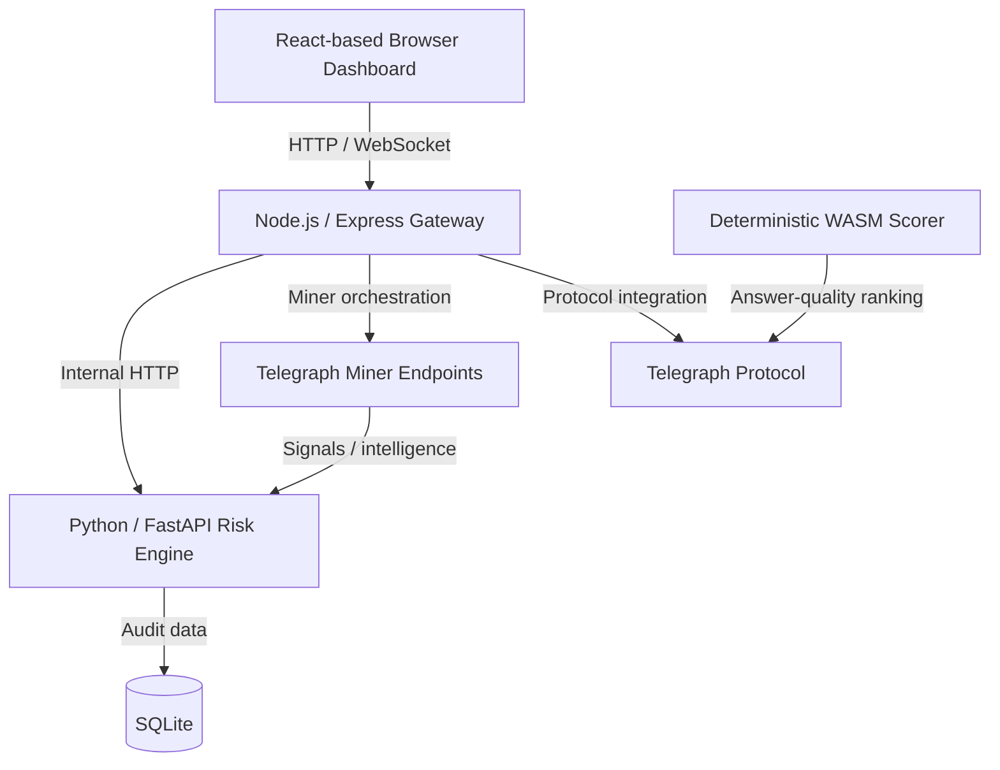

# Telegraph Sentinel — System Architecture

Telegraph Sentinel is organized as a browser dashboard, a Node.js gateway, a Python risk-analysis service, persistence, Telegraph integration, and a deterministic WASM scoring component.

## Components

1. **Browser dashboard** — the user-facing React-based interface served by the Node.js application.
2. **Node.js / Express gateway** — exposes the application and miner-facing HTTP API and coordinates downstream services.
3. **Python / FastAPI risk engine** — performs the project's risk-analysis work and supports the gateway's analysis flow.
4. **Telegraph integration** — connects the application to the Telegraph miner/integration workflow.
5. **WASM scorer** — provides deterministic answer-quality scoring for the Telegraph evaluation workflow.
6. **SQLite persistence** — stores application/audit data used by the runtime.
7. **WebSockets** — provide real-time browser updates where supported by the application.

## Deployment topology

The production gateway/dashboard is deployed at:

`https://telegraph-sentinel-d68u.onrender.com`

Local development uses the gateway on `http://localhost:4000` unless the local configuration specifies another port.

For the complete deployment procedure, see [`deployment.md`](deployment.md).
